# รายงานการทดลอง และ Case study#
# สัปดาห์ที่ 11 การใช้งาน git ร่วมกับ Visual studio IDE #
-----------
## Experiment ##
### 11.1 การสร้าง repository บน GitHub ด้วย Visual Studio ###
```
มี repository ปรากฎขึ้นบน github.com หลังสร้าง repository ด้วย Visual Studio
```
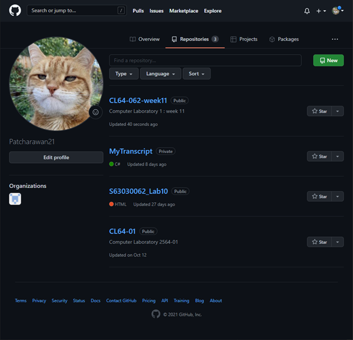

```
ภาพหน้าจอจากการ build และ run program "Hello"
```

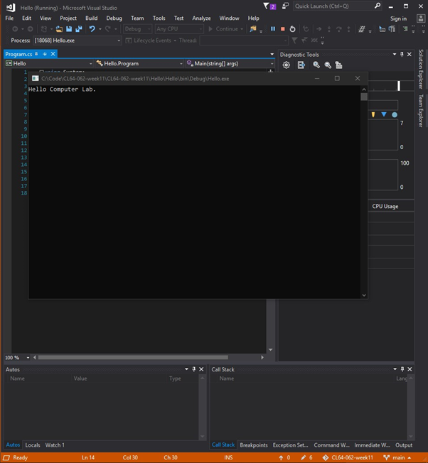

```
เมื่อทำการ sync พบว่า repository บน github มีการ update 
โดยมี commit ตามที่ตั้งไว้ และไฟล์ต่างๆได้ถูก push ขึ้นมาบน repository ดังกล่าว เรียบร้อย
```

<table>
<tr>
<td></td>
<td>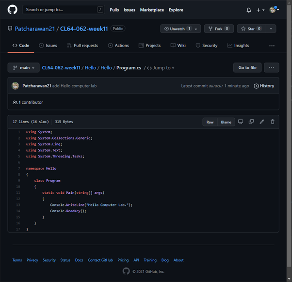</td>
</tr>
</table>

### 11.2 การ clone จาก repository ด้วย Visual Studio ###
```
ผลการสร้าง repo บน github.com
```
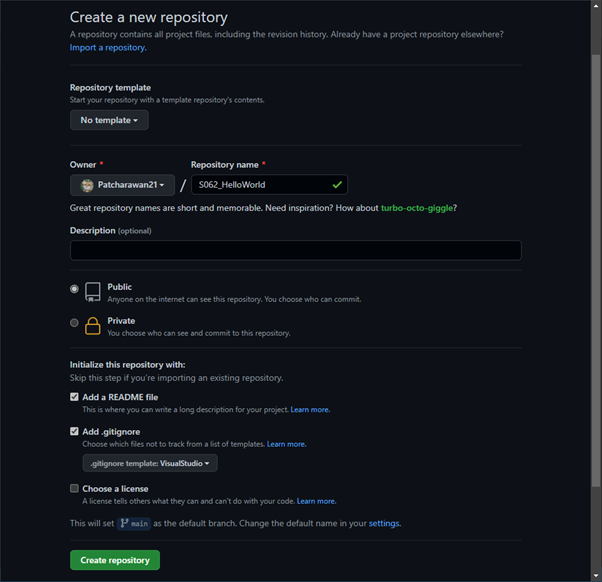
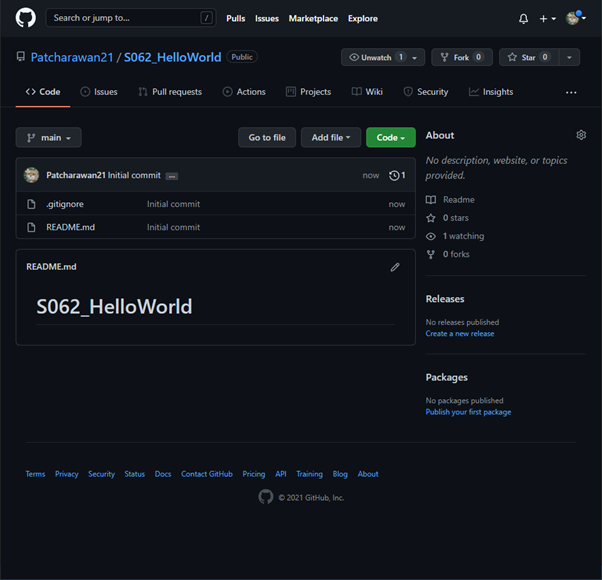

```
หน้าจอ Visual Studio ของ Windows Forms App
```

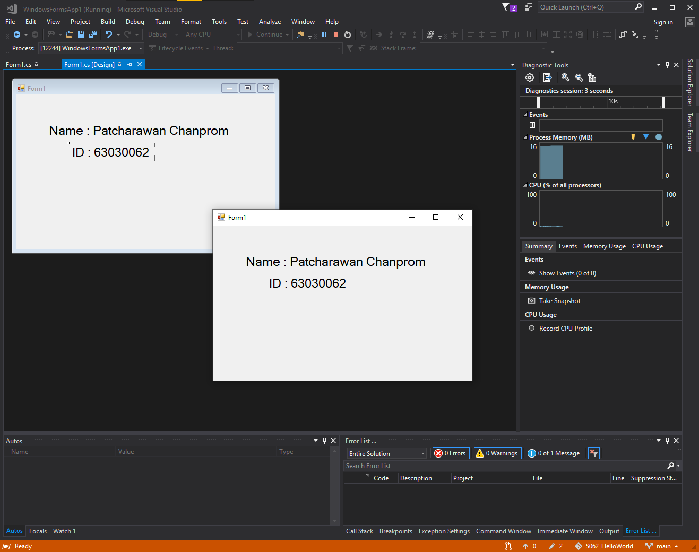

-----------
## Case Study : My Transcript ##
สามารถเข้าถึง repository ได้ โดย [คลิกที่นี่](https://github.com/Patcharawan21/MyTranscript.git)

### Branch 4 เพิ่มข้อมูลไปยัง DataGridView ###
สามารถเพิ่มข้อมูลไปยัง Form1 ได้ถูกต้อง 
โดยมีการแก้ไขการรับข้อมูลในส่วนของ Credit ในฟังก์ชัน AddGrade
และสามารถเพิ่ม course ได้หลายอัน

``` cs
private void AddGrade(object sender, EventArgs e)
{
    Course newCourse = new Course();
    newCourse.CourseID = textBoxCourseID.Text;
    newCourse.CourseName = textBoxCourseName.Text;
    newCourse.CourseCredit = textBoxCourseCredit.Text;
    newCourse.Grade = textBoxGrade.Text;
}
```
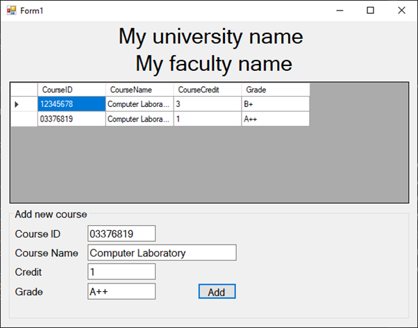

### Branch 5 เพิ่ม tab control เพื่อแยกภาคการศึกษา ###
เพิ่ม tab ตามจำนวนภาคการศึกษา รวม 8 ภาคการศึกษา และการฝึกงานในอีก 1 ภาคฤดูร้อน
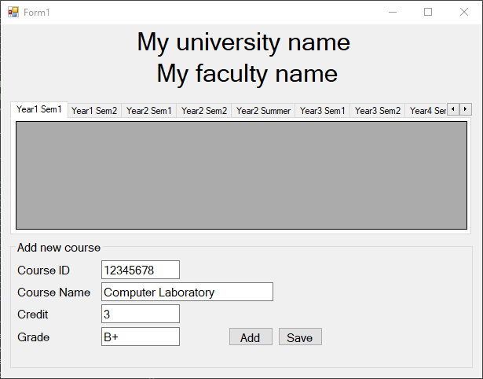

### Branch 6 Save files ###
สร้าง switch case เพื่อแยก selectedIndex ของ tab ตามภาคการศึกษาลงในฟังก์ชัน AddGrade
``` cs
private void AddGrade(object sender, EventArgs e)
{
    Course newCourse = new Course();
    newCourse.CourseID = textBoxCourseID.Text;
    newCourse.CourseName = textBoxCourseName.Text;
    newCourse.CourseCredit = textBoxCourseCredit.Text;
    newCourse.Grade = textBoxGrade.Text;

    switch (tabControl1.SelectedIndex)
    {
        case 0: //Y1S1
            dataGridViewY1S1.DataSource = null;
            year1Sem1.Add(newCourse);
            dataGridViewY1S1.DataSource = year1Sem1;
            break;
        case 1: //Y1S2
            dataGridViewY1S2.DataSource = null;
            year1Sem2.Add(newCourse);
            dataGridViewY1S2.DataSource = year1Sem2;
            break;
        case 2: //Y2S1
            dataGridViewY2S1.DataSource = null;
            year2Sem1.Add(newCourse);
            dataGridViewY2S1.DataSource = year2Sem1;
            break;
        case 3: //Y2S2
            dataGridViewY2S2.DataSource = null;
            year2Sem2.Add(newCourse);
            dataGridViewY2S2.DataSource = year2Sem2;
            break;
        case 4: //Y2SS (Summer)
            dataGridViewY2SS.DataSource = null;
            year2SemS.Add(newCourse);
            dataGridViewY2SS.DataSource = year2SemS;
            break;
        case 5: //Y3S1
            dataGridViewY3S1.DataSource = null;
            year3Sem1.Add(newCourse);
            dataGridViewY3S1.DataSource = year3Sem1;
            break;
        case 6: //Y3S2
            dataGridViewY3S2.DataSource = null;
            year3Sem2.Add(newCourse);
            dataGridViewY3S2.DataSource = year3Sem2;
            break;
        case 7: //Y4S1
            dataGridViewY4S1.DataSource = null;
            year4Sem1.Add(newCourse);
            dataGridViewY4S1.DataSource = year4Sem1;
            break;
        case 8: //Y4S2
            dataGridViewY4S2.DataSource = null;
            year4Sem2.Add(newCourse);
            dataGridViewY4S2.DataSource = year4Sem2;
            break;
    }
}
```

สร้างฟังก์ชัน SaveFile ที่รองรับการเพิ่มทุกภาคการศึกษาลงไปในไฟล์

``` cs
private void SaveFile(object sender, EventArgs e)
{
    StringBuilder sb = new StringBuilder();
    int counter;

    sb.AppendLine(labelUniversityName.Text);
    sb.AppendLine(labelFacultyName.Text);

    // Year 1 Semester 1
    if (year1Sem1.Count > 0)
    {
        sb.AppendLine("");
        sb.AppendLine("Year 1 Semester 1");
        sb.AppendLine("No, Course ID, Course Name, Credit, Grade");
        counter = 1;
        foreach (var item in year1Sem1)
        {
            sb.AppendLine(counter.ToString() + ", " + item.ToString());
            counter++;
        }
    }

    // Year 1 Semester 2
    if (year1Sem2.Count > 0)
    {
        sb.AppendLine("");
        sb.AppendLine("Year 1 Semester 2");
        sb.AppendLine("No, Course ID, Course Name, Credit, Grade");
        counter = 1;
        foreach (var item in year1Sem2)
        {
            sb.AppendLine(counter.ToString() + ", " + item.ToString());
            counter++;
        }
    }

    // Year 2 Semester 1
    if (year2Sem1.Count > 0)
    {
        sb.AppendLine("");
        sb.AppendLine("Year 2 Semester 1");
        sb.AppendLine("No, Course ID, Course Name, Credit, Grade");
        counter = 1;
        foreach (var item in year2Sem1)
        {
            sb.AppendLine(counter.ToString() + ", " + item.ToString());
            counter++;
        }
    }

    // Year 2 Semester 2
    if (year2Sem2.Count > 0)
    {
        sb.AppendLine("");
        sb.AppendLine("Year 2 Semester 2");
        sb.AppendLine("No, Course ID, Course Name, Credit, Grade");
        counter = 1;
        foreach (var item in year2Sem2)
        {
            sb.AppendLine(counter.ToString() + ", " + item.ToString());
            counter++;
        }
    }

    // Year 2 Summer
    if (year2SemS.Count > 0)
    {
        sb.AppendLine("");
        sb.AppendLine("Year 2 Summer");
        sb.AppendLine("No, Course ID, Course Name, Credit, Grade");
        counter = 1;
        foreach (var item in year2SemS)
        {
            sb.AppendLine(counter.ToString() + ", " + item.ToString());
            counter++;
        }
    }

    // Year 3 Semester 1
    if (year3Sem1.Count > 0)
    {
        sb.AppendLine("");
        sb.AppendLine("Year 3 Semester 1");
        sb.AppendLine("No, Course ID, Course Name, Credit, Grade");
        counter = 1;
        foreach (var item in year3Sem1)
        {
            sb.AppendLine(counter.ToString() + ", " + item.ToString());
            counter++;
        }
    }

    // Year 3 Semester 2
    if (year3Sem2.Count > 0)
    {
        sb.AppendLine("");
        sb.AppendLine("Year 3 Semester 2");
        sb.AppendLine("No, Course ID, Course Name, Credit, Grade");
        counter = 1;
        foreach (var item in year3Sem2)
        {
            sb.AppendLine(counter.ToString() + ", " + item.ToString());
            counter++;
        }
    }

    // Year 4 Semester 1
    if (year4Sem1.Count > 0)
    {
        sb.AppendLine("");
        sb.AppendLine("Year 4 Semester 1");
        sb.AppendLine("No, Course ID, Course Name, Credit, Grade");
        counter = 1;
        foreach (var item in year4Sem1)
        {
            sb.AppendLine(counter.ToString() + ", " + item.ToString());
            counter++;
        }
    }

    // Year 4 Semester 2
    if (year4Sem2.Count > 0)
    {
        sb.AppendLine("");
        sb.AppendLine("Year 4 Semester 2");
        sb.AppendLine("No, Course ID, Course Name, Credit, Grade");
        counter = 1;
        foreach (var item in year4Sem2)
        {
            sb.AppendLine(counter.ToString() + ", " + item.ToString());
            counter++;
        }
    }

```

นอกจากนี้ยังมี code ส่วนที่รองรับ SaveFileDialog ในฟังก์ชัน SaveFile อีกด้วย เพื่อให้ผู้ใช้งานสามารถเลือกตำแหน่งของการเก็บไฟล์ได้ตามใจชอบ

``` cs

    SaveFileDialog saveFileDialog1 = new SaveFileDialog();
    saveFileDialog1.Title = "Save CSV Files";
    saveFileDialog1.CheckFileExists = false;
    saveFileDialog1.CheckPathExists = true;
    saveFileDialog1.DefaultExt = "csv";
    saveFileDialog1.FilterIndex = 2;
    saveFileDialog1.Filter = "CSV files (*.csv)|*.csv|All files (*.*)|*.*";
    saveFileDialog1.RestoreDirectory = true;
    if (saveFileDialog1.ShowDialog() == DialogResult.OK)
    {
        WriteToFile(saveFileDialog1.FileName, sb);
    }
}
```

ผลการทำงาน
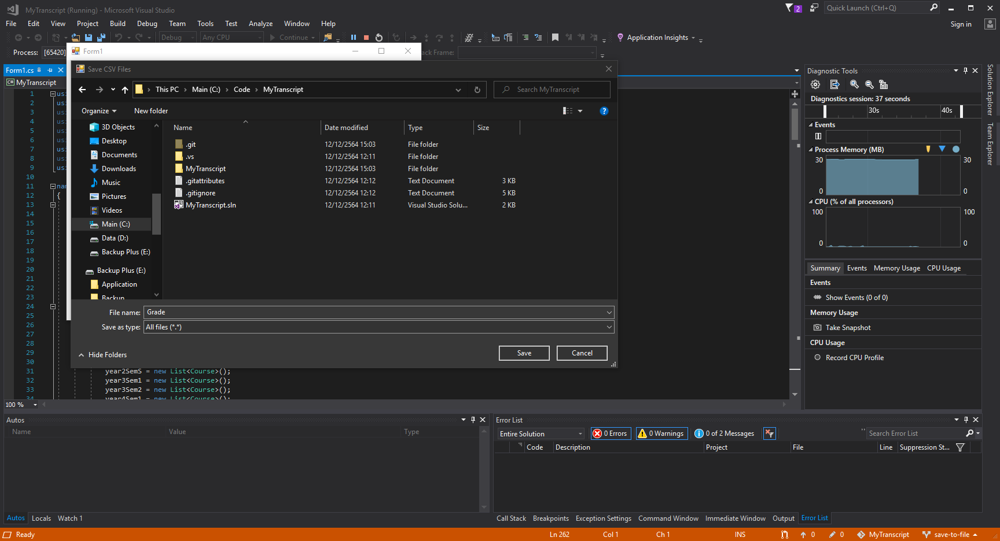
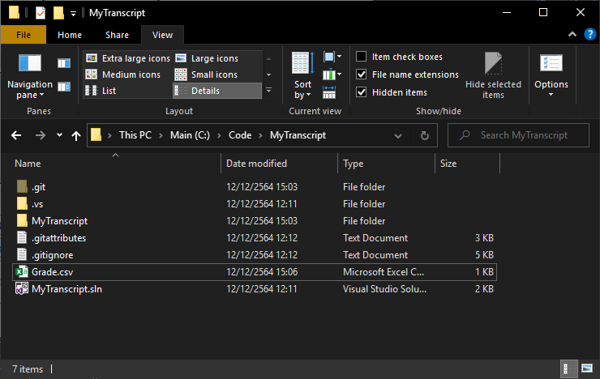
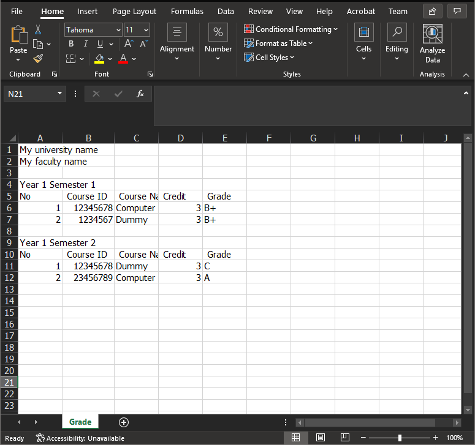